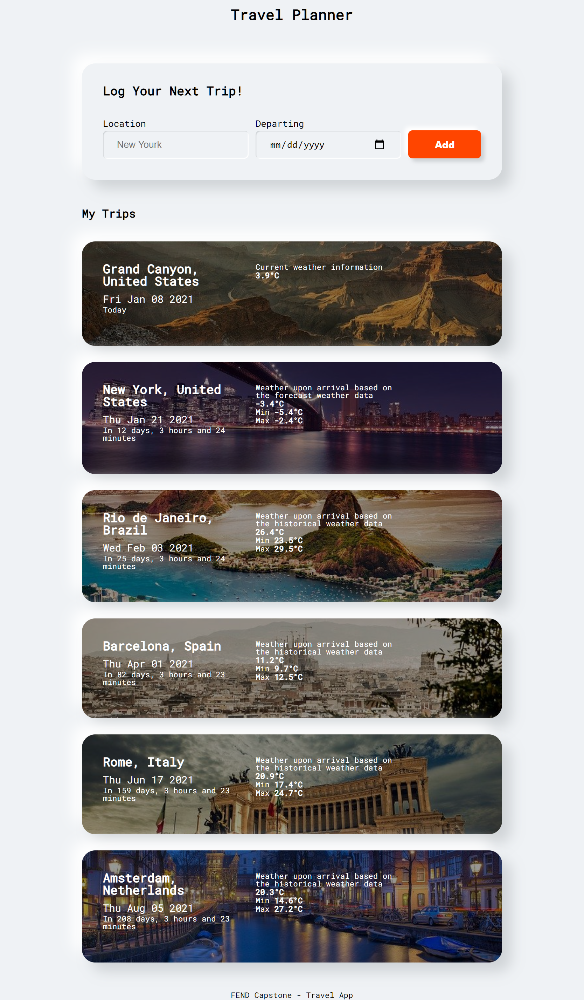

# FEND Capstone - Travel App

The project includes a simple form where you enter the location you are traveling to and the date of departure, then you will get the weather information at the time of arrival and how many days left.



Technologies used:
- Webpack 
- Express
- Node
- Sass
- Service Workers
- Jest
- Babel

### Installation
```
npm install
```

### To run development server (frontend dev on port 8082, backend api on port 8081)
```
npm run build-dev
npm run start
```

### To build production server (port 8081)
```
npm run build-prod
npm run start
```

### To start express server
```
npm run start
```

### To run tests
```
npm run test
```

### Extend Options / Ways to Stand Out
Pull in an image for the country from Pixabay API when the entered location brings up no results.